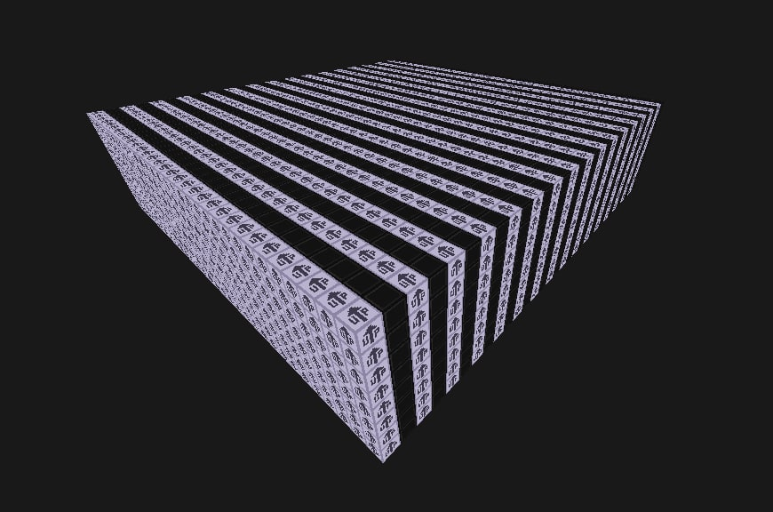

# unnamed voxel game
Trying to make a voxel sandbox with multiplayer support and survival elements.

## Build Instructions
1. Install the Rust toolchain: https://rustup.rs
2. Clone the repository: `git clone git@github.com:Saxarok/voxelgame.git`
3. Navigate to the cloned repository's directory: `cd voxelgame`
4. Compile the program: `cargo build --release`

### WASM support
Install [wasm-pack](https://rustwasm.github.io/wasm-pack/installer/) and build with: ` wasm-pack build --target web`. You can run a simple web server for testing purposes by executing: `py test-server.py`. Provided python script should start a local web server on port `8080`.

## Running
Currently, the client automatically tries to connect on `127.0.0.1:16000` with a random name. To chose a name set the `NAME` environment variable. Client crashes if the connection fails, so start the server with: `cargo run --bin server` before running it. To enable logging set the `RUST_LOG` environment variable to `voxelgame=trace`.

## Temporary todo list
* Come up with a nice shader/pipeline abstraction
* Refactor code to use a reference to `queue` instead of `Rc`
* Think of a proc derive macro for `Bindable`
* Introduce a concept of a resource store
* Specify all `Bindable`s in a pipeline and automatically bind them
* Multithreading and async support
* Implement packet buffering

## Special Thanks
* [Vilkillian](https://github.com/orgs/OpenGames/people/ZecosMAX) - helped with UV coordinates